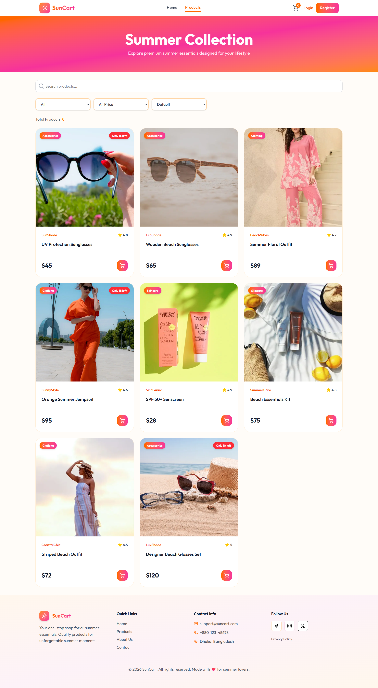
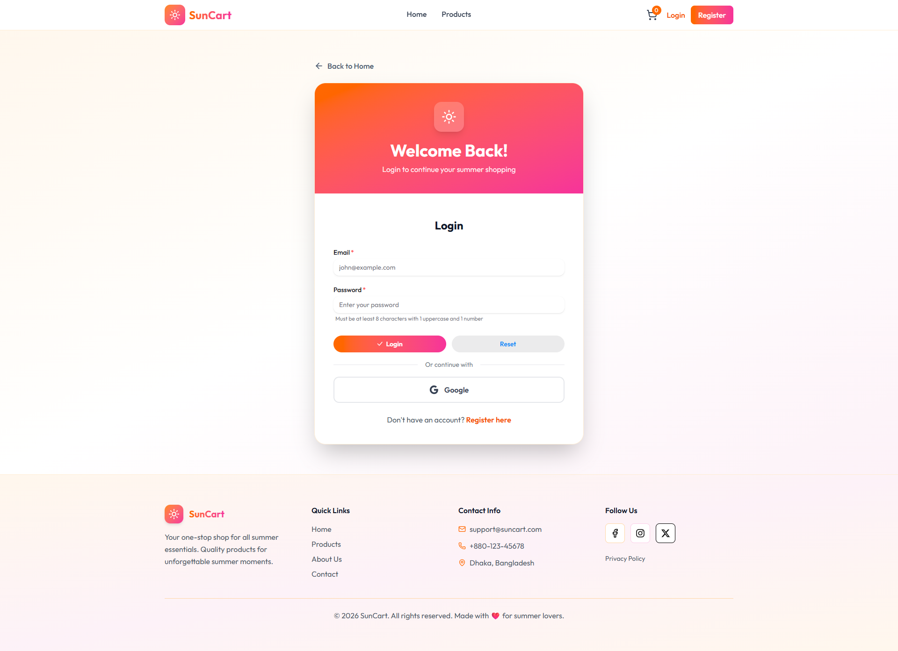
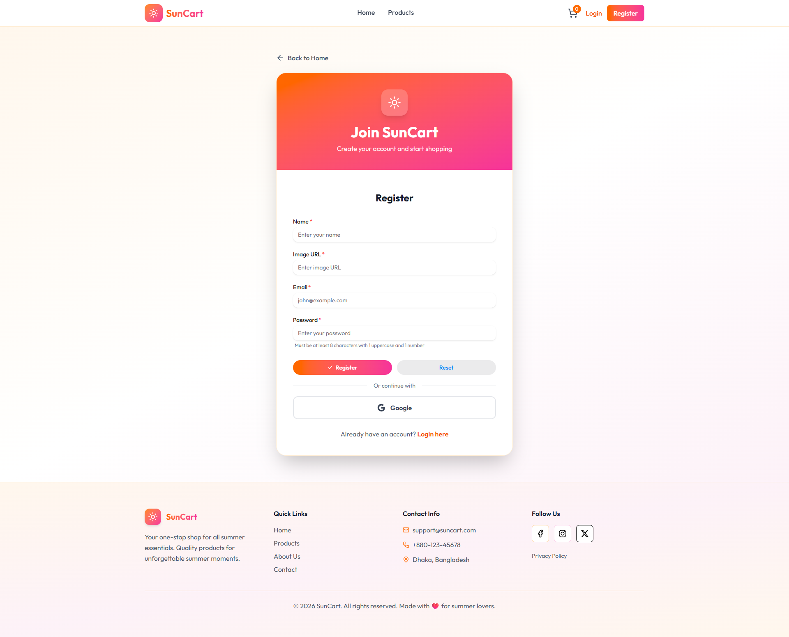
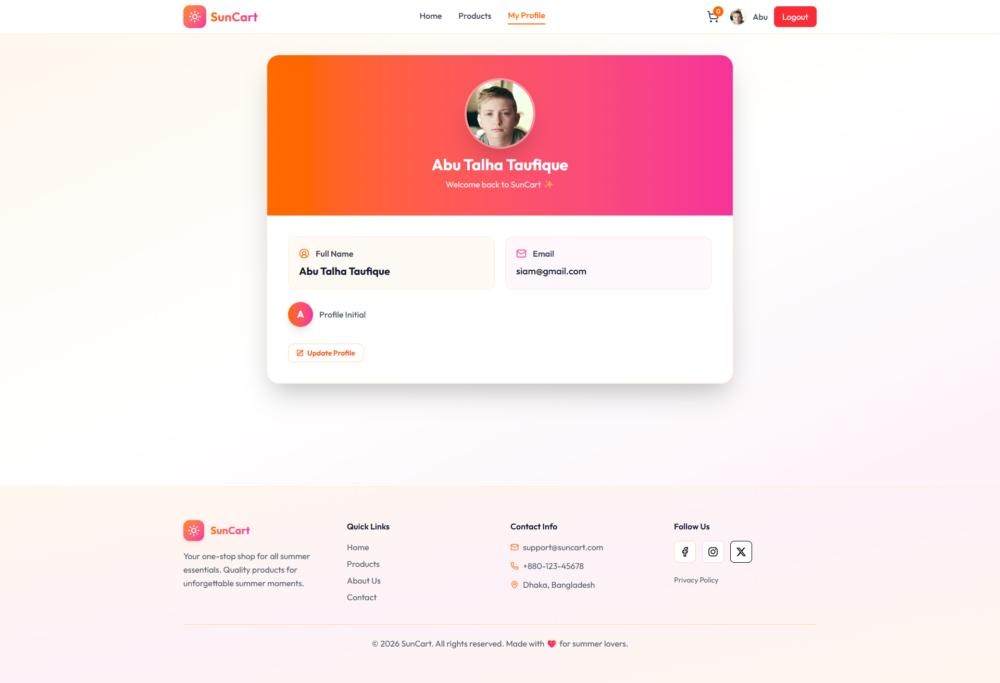
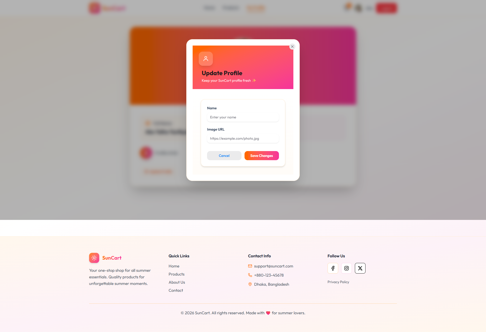
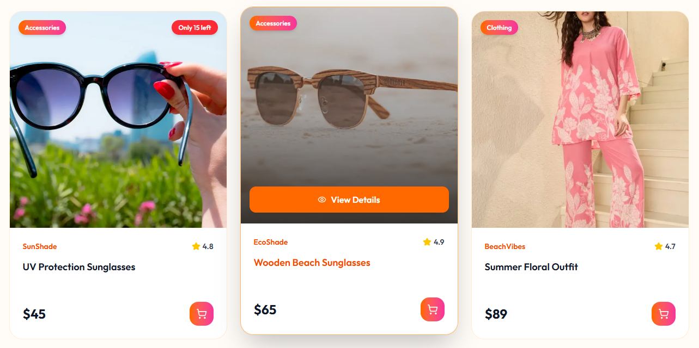

<div align="center">

# ☀️ SunCart – Summer Essentials Store

### *Your one-stop destination for premium summer essentials.*

A high-performance, modern eCommerce platform built with **Next.js**, designed to deliver a seamless shopping experience with secure authentication, smart product filtering, and a vibrant summer-inspired UI.

<br/>

[](https://nextjs.org/)
[](https://tailwindcss.com/)
[](https://www.mongodb.com/atlas)
[](https://better-auth.com/)
[](https://heroui.com/)

</div>

---

## 🌐 Live Demo

👉 **[View SunCart Live](https://sun-cart-a08.vercel.app/)**

---

## 📖 Overview

**SunCart** is a modern summer-themed eCommerce platform where users can explore and purchase seasonal products such as sunglasses, summer outfits, skincare items, beach accessories, and more. 

It provides a seamless shopping experience where users can browse products, view detailed information, and place orders after secure authentication, ensuring both convenience and safety in the buying process.

Built with **Next.js App Router**, it focuses on performance, scalability, and security using **BetterAuth**, while delivering a smooth and visually engaging shopping experience.

---

## 📸 Project Showcase

### 🌅 Homepage


A vibrant landing page showcasing featured summer essentials with a clean and modern UI.

---

### 🛍️ Product Discovery

<details>
<summary><strong>📦 View Product Collection</strong></summary>
<br/>



Advanced product listing with search, filtering, and sorting by price and rating for an optimized shopping experience.

</details>

---

### 🔐 Authentication System

<details>
<summary><strong>🔑 Login Page</strong></summary>
<br/>



Secure login system with email/password and Google authentication support.

</details>

<details>
<summary><strong>🆕 Register Page</strong></summary>
<br/>



User-friendly registration system with smooth validation and UI feedback.

</details>

---

## 👤 User Profile System

<details>
<summary><strong>🧑 Profile Dashboard</strong></summary>
<br/>



Displays authenticated user details including name, email, and profile image.

</details>

---

<details>
<summary><strong>✏️ Update Profile</strong></summary>
<br/>



Allows users to update their profile information instantly through a modal interface.

</details>

---

## 🛒 Product Cards

<details>
<summary><strong>🛍️ View Product Cards</strong></summary>
<br/>



Clean and responsive product cards featuring ratings, pricing, and brand details.

</details>

---

## ✨ Key Features

- 🛒 Advanced product search, filtering, and sorting  
- 🔐 Secure authentication with BetterAuth (Email & Google Login)  
- 🚫 Protected routes for product details & profile pages  
- ⚡ Next.js App Router for optimized routing  
- 👤 Dynamic user profile management  
- 🍃 MongoDB Atlas integration for scalable and secure database management  
- 📱 Fully responsive design across all devices  
- 🔔 Real-time toast notifications  
- 🎭 Smooth UI animations with Animate.css  

---

## 🛠 Tech Stack

| Technology | Purpose |
|------------|---------|
| Next.js | Full-stack React framework |
| Tailwind CSS | Styling & responsive design |
| MongoDB Atlas | Cloud database for scalable data storage |
| BetterAuth | Authentication system |
| HeroUI | UI component system |
| Gravity UI | Modern UI components and design system |
| Lucide React Icons | Icon system for clean and modern UI |
| Sooner | Toast notifications |
| Animate.css | UI animations |

---

## 🚀 Getting Started

### Clone Repository

```bash
git clone https://github.com/your-username/sun-cart.git
cd sun-cart
npm install
npm run dev
```

---

## 📱 Responsive Design

SunCart is fully responsive and optimized for mobile, tablet, and desktop devices, ensuring a smooth and consistent shopping experience across all screen sizes.

---

## 💙 Author

<div align="center">

Made with 💙 by [Abu Talha Taufique](https://github.com/abutalha08)

*SunCart — modern eCommerce for a brighter summer shopping experience.*

© 2026 SunCart. All rights reserved.

</div>